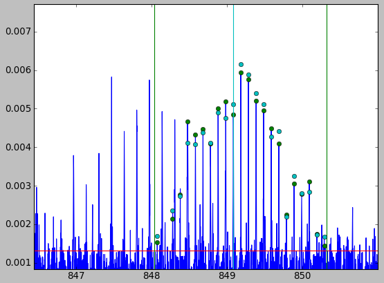

This little program semi-automatically fits the exact position and
abundance of peaks belonging to the same fragment in e.g. top-down
mass spectra of proteins and can be used for a variety of other
purposes, like extracting exact centroid masses for
Hydrogen-Deuterium-Exchange (HDX) experiments.

In case of questions or suggestions please contact me at
<daniel@tydirium.org>.

Downloads
=========

The latest version can be downloaded from
[here](http://www.tydirium.org/cgi-bin/fossil/HDXtool/zip/HDXtool-latest.zip?uuid=tip).

Installation
============

Prerequisites: You will need the following packages

-   [Python interpreter](http://www.python.org/)
-   [py-yaml](http://pyyaml.org/)
-   [wxPython](http://wxpython.org/)
-   [matplotlib](http://matplotlib.sourceforge.net/)
-   [SciPy](http://www.scipy.org/)

After having these packages installed, run the HDXtool.py script.

Usage
=====

The workflow is like this:

1.  Load a datafile containing comma separated XY mass spectrum,
    e.g. like the included "test.dat". This loads the file and opens a
    window showing the mass spectrum.
    
2.  Next, press the "Region Of Interest" (ROI) button and click on
    three points in the spectrum plot to define the baseline
    (everything over the baseline will be searched for peaks), the left
    boundary for the search and finally the right boundary of the
    fragment you want to work on. You will get three lines in the
    spectrum plot.
    
3.  Press "Suggest" and then click on the highest peak in the fragment
    series, which will be fitted and the fit will be shown in a new
    window.
    
4.  Click on the next peak to the right or left of the main peak, which
    will be fitted again.
    
5.  The program will now try to find all peaks belonging to the
    fragment, fit them and mark the position in the spectrum
    plot. Finally, it will show the fitted curves in a new window.
    
6.  If you like the fit, press "Accept" and the peak location will be
    saved. A line in the main window shows the centroid mass and
    position and charge state.
    
7.  By right-clicking on a line you can delete a fragment, add a
    comment or copy the selection to the clipboard for e.g. pasting
    into Excel.
    
8.  Finally, pressing the "Save button" will generate a ascii text
    in YAML format with the fitted data. The next time the data file
    with the fitting procedureis openend, the fitdata is imported so
    that you can continue .

Output data format
==================

The fitted data is in [YAML](http://en.wikipedia.org/wiki/YAML)-format
which is a standardized ascii text that can be easily parsed and is
also human readable. The file contains data for all fragments in the
following fields:

-   Lower boundary ("low")
-   High boundary ("high")
-   Baseline ("thres")
-   Centroid mass ("centroid")
-   Charge state ("charge state")
-   The actual peak positions ("peaks")